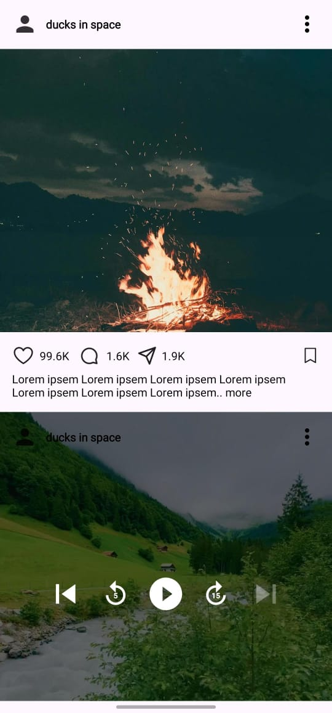
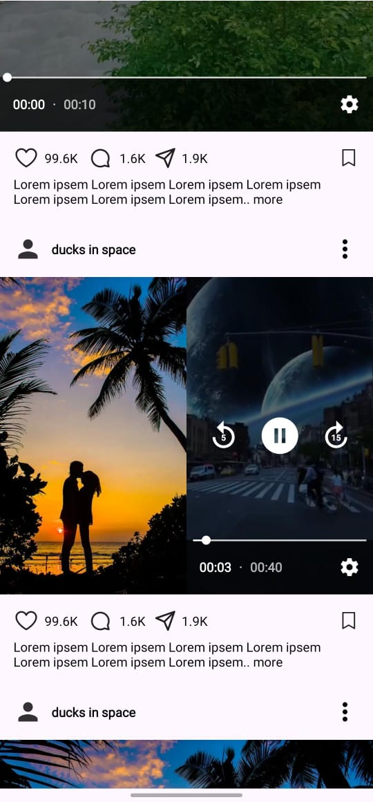

# Instagram-like Feed Sample

A performant Android scrollable feed consisting of a few posts to display a single photo, a single video, and a combination of one photo and one video. The implementation demonstrating media handling, smooth scrolling, and efficient caching strategies. The data is locally stored images and videos bundled within the application. The Architecture is compatible to handle the data from remote data source as well.  

## Features
**Smart Video Playback**
    - Auto-play visible videos
    - Pause on scroll
    - TextureView rendering

**Mixed Media Support**
    - Image posts
    - Video posts
    - Combined image+video posts

**Performance Optimizations**
    - RecyclerView view recycling
    - Player instance pooling
    - Media content caching

**Smooth Scrolling**
    - Prefetching mechanism

## Tech Stack
- **Language**: Kotlin
- **Architecture**: MVVM
- **Data Layer**: Repository Pattern 
- **UI Layer**: Views
- **Dependency Injection**: Hilt
- **Media Playback**:
    - Android Media3 ExoPlayer
    - `@UnstableApi` used per Media3 requirements
- **Image Loading**: Glide
- **Caching**:
    - Media3 SimpleCache (50MB)
    - Glide disk cache
- **Build System**: Gradle

## Media3 API Stability Note

This project uses Android Media3's `@UnstableApi`-annotated components as:
1. Required for core video playback functionality
2. Following [Google's official guidance](https://developer.android.com/media/media3/exoplayer/migration-guide)
3. Note about using `@UnstableApi`annotations: https://developer.android.com/reference/androidx/media3/common/util/UnstableApi
4. With explicit opt-in via `@OptIn(UnstableApi::class)`

These APIs are considered stable for production use per Media3's documentation.

## Clone the Repository: 
 - https://github.com/dev-habib-rehman/InstagramFeedsSample**

- Open the project in Android Studio (latest version recommended). Sync the project to download all dependencies. Build and run the app on an emulator or a physical device.

## Screenshots 

- Feel free to reach out for questions or issues. Enjoy exploring the app!
